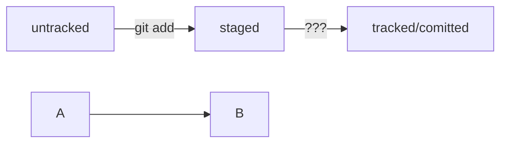

- Система контроля версий, или VCS (SCM), — программа, позволяющая контролировать изменения в проекте.
- Git — один из примеров системы контроля версий: он позволяет хранить, изменять и анализировать историю проекта.
- Git — незаменимый в команде инструмент, ведь он помогает объединять результаты работы нескольких человек.
## Консоль
Узнать, где вы сейчас, поможет команда `pwd` (от англ. _**p**rint **w**orking **d**irectory_ — «показать рабочую папку»). Она выводит путь к текущей директории.

Когда вы открываете командную строку, вы оказываетесь именно в домашней директории. Перейти к домашней директории: ввести команду `cd` (от англ. _**c**hange **d**irectory_ — «сменить директорию») и символ **`~`** — обозначение домашней директории.

- Консольные и графические интерфейсы — два способа взаимодействия с программами.
- Консоль, терминал, или командная строка, — это программа, которая считывает команду пользователя и выполняет её.
- Чтобы вывести текущую рабочую директорию, можно использовать команду `pwd`.
- У большинства пользователей компьютера есть доступ к домашней директории. Чтобы к ней перейти, используют команду `cd ~`.
***
Для отображения файлов и папок в консоли используют команду — `ls` (от англ. _**l**i**s**t directory contents_ — «отобразить содержимое директории»). Если в названии папки есть пробелы, при вводе нужно использовать кавычки. `ls` с флагом `-a` и выводит расширенный список со скрытыми файлами.
Чтобы вернуться в **родительскую директорию** — то есть на уровень выше, — вместо названия папки нужно написать две точки: `..` 
Чтобы обратиться к текущей директории, можно использовать `.`

`ls ~` выведет содержимое домашней директории вне зависимости от того, что показывает `pwd`. А `ls ..` покажет содержимое родительской директории.

- менять директории командой `cd`;
- выводить содержимое директорий с помощью `ls`;
- просматривать содержимое вместе со скрытыми файлами и папками через `ls -a`.
***
Чтобы создать файл, нужно ввести в консоль команду `touch` (англ. «коснуться») с именем файла. Команда `touch ../../file.txt` создаст файл `file.txt` на две папки выше по иерархии.

Для создания директорий через терминал используют другую команду — `mkdir`

Для копирования файлов через терминал существует команда `cp` (от англ. _**c**o**p**y_ — «копировать»). Можно указать сразу несколько файлов:
```
$ cp что_копируем что_копируем что_копируем куда_копируем

$ cp new.txt text.txt "New dir"
```

Перемещение файлов и папок — `mv`, аналогично `cp`

- Команда `touch` создаёт файл, а команда `mkdir` — директорию.
- С помощью флага `-p` можно создать целую структуру директорий одной командой: `mkdir -p`.
- Для копирования файлов используют команду `cp`, для перемещения — `mv`.
***
Чтобы прочитать файл, в консоль нужно ввести `cat` (от англ. c_on**cat**enate and print_ — «объединить и распечатать»). Команда распечатает то, что содержится в нём. Работает только с текстовыми файлами.

Чтобы удалить файл, нужно напечатать команду `rm` (от англ. _**r**e**m**ove —_ «удалить»)
Удалить папку можно командой `rmdir` (от англ. _**r**e**m**ove **dir**ectory —_ «удалить директорию»). Если папка не пуста, то её можно удалить сочетанием: `rm -r "New dir"`.
!удаление объектов командами `rm` и `rmdir` необратимо!


- Вывести содержимое файла можно командой `cat`.
- Для удаления файла используют `rm`, для удаления пустой директории — `rmdir`, а для директории с файлами — `rm -r`.
- Все команды удаления стирают данные безвозвратно — их нельзя будет восстановить из корзины!
***
Команды можно выполнять сразу списком. Для этого их нужно разделить двумя амперсандами (`&&`).

Чтобы обратиться к последней введённой команде, нажмите на клавиатуре стрелку вверх (**`↑`**). Чтобы вернуться нажмите стрелку вниз (**`↓`**).

Если нужно найти какую-нибудь из команд, достаточно набрать в командной строке буквы с которых она начинается и дважды нажать клавишу `Tab`. Дописывает не только команды, но и пути

Чтобы увидеть содержимое **корневой директории** (англ. _root directory_ (перед С:)) напечатайте в командной строке слеш (`/`) и дважды нажмите `Tab`. В эту директорию тоже можно быстро перемещаться — с помощью команды `cd /`

- С помощью `&&` можно выполнить несколько команд сразу — одну за другой.
- Команды, которые вы выполняете в консоли, попадают в историю. Вы можете перемещаться по этой истории при помощи стрелок **`↑↓`**.
- При нажатии на `Tab` консоль предложит несколько вариантов продолжения команды.
- Символами `/` и `~` можно быстро перемещаться к корневой и домашней директориям.
***
Заполнить настройки можно командой: `git config --global`
Например: `git config --global user.name "Maks Nogin"`

Прочитать свои параметры можно с помощью `cat ~/.gitconfig`. Вывести содержимое файла конфигурации Гит  `$ git config --list`.

Удалить данные: `git config --global --unset user.name`  или, чтобы удалить все одинаковые значения `git config --global --unset-all user.name` 


## Навигация

- `pwd` (от англ. _**p**rint **w**orking **d**irectory_, «показать рабочую папку») — покажи, в какой я папке;
- `ls` (от англ. _**l**i**s**t directory contents_, «отобразить содержимое директории») — покажи файлы и папки в текущей папке;
- `ls -a` — покажи также скрытые файлы и папки, названия которых начинаются с символа `.`;
- `cd first-project` (от англ. _**c**hange **d**irectory_, «сменить директорию») — перейди в папку `first-project`;
- `cd first-project/html` — перейди в папку `html`, которая находится в папке `first-project`;
- `cd ..` — перейди на уровень выше, в родительскую папку;
- `cd ~` — перейди в домашнюю директорию (`/Users/Username`);
- `cd /` — перейди в корневую директорию.

## Работа с файлами и папками
**Создание**

- `touch index.html` (англ. _touch,_ «коснуться») — создай файл `index.html` в текущей папке;
- `touch index.html style.css script.js` — если нужно создать сразу несколько файлов, можно напечатать их имена в одну строку через пробел;
- `mkdir second-project` (от англ. _**m**a**k**e **dir**ectory_, «создать директорию») — создай папку с именем `second-project` в текущей папке.
- 
**Копирование и перемещение**

- `cp file.txt ~/my-dir` (от англ. _**c**o**p**y_, «копировать») — скопируй файл в другое место;
- `mv file.txt ~/my-dir` (от англ. _**m**o**v**e_, «переместить») — перемести файл или папку в другое место.

**Чтение**

- `cat file.txt` (от англ. _con**cat**enate and print_, «объединить и распечатать») — распечатай содержимое текстового файла `file.txt`.

**Удаление**

- `rm about.html` (от англ. _**r**e**m**ove_, «удалить») — удали файл `about.html`;
- `rmdir images` (от англ. _**r**e**m**ove **dir**ectory_, «удалить директорию») — удали папку `images`;
- `rm -r second-project` (от англ. _**r**e**m**ove,_ «удалить» + _**r**ecursive_, «рекурсивный») — удали папку `second-project` и всё, что она содержит.

## Полезные возможности

- Команды необязательно печатать и выполнять по очереди. Можно указать их списком — разделить двумя амперсандами (`&&`).
- У консоли есть собственная память — буфер с несколькими последними командами. По ним можно перемещаться с помощью клавиш со стрелками вверх (**`↑`**) и вниз (**`↓`**).
- Чтобы не вводить название файла или папки полностью, можно набрать первые символы имени и дважды нажать `Tab`. Если файл или папка есть в текущей директории, командная строка допишет путь сама.
    
    Например, вы находитесь в папке `dev`. Начните вводить `cd first` и дважды нажмите `Tab`. Если папка `first-project` есть внутри `dev`, командная строка автоматически подставит её имя. Останется только нажать `Enter`.
***
## Git
Чтобы Git начал отслеживать изменения в проекте, папку с файлами этого проекта нужно сделать **Git-репозиторием** (от англ. _repository_ — «хранилище»). Для этого следует переместиться в неё и ввести команду `git init` (от англ. _**init**ialize_ — «инициализировать»).

Если вы случайно сделали Git-репозиторием не ту папку, её можно «разгитить». Для этого нужно удалить скрытую подпапку `$ rm -rf .git`. 
- ключ `-r` (от англ. _**r**ecursive_ — «рекурсивно») позволяет удалять папки вместе с их содержимым;
- ключ `-f` (от англ. _**f**orce_ — «заставить») избавит вас от вопросов вроде «Вы точно хотите удалить этот файл? А этот?».
Если удалить `.git`, то вся история проекта будет стёрта
***
Подготовить файлы к сохранению — `git add`. можем использовать команду `git add --all`, можно добавить текущую папку целиком `git add .` команда `git add` только запоминает текущее содержимое (контент) файла. 

Само сохранение, или фиксацию состояния файлов, называют **коммитом** (от англ. _commit_ — «совершать», «фиксировать»).

- Команда `git add` позволяет подготовить файл к сохранению.
- Команда `git add --all` подготовит к сохранению сразу все файлы.
- С помощью `git add .` можно добавить в репозиторий текущую папку со всеми файлами.
***
Сделать коммит можно командой `git commit` c ключом `-m` (от англ. _**m**essage_ — «сообщение»), который присваивает коммиту сообщение.

Просмотреть историю коммитов — `git log`

- GitHub — платформа, которая работает с Git и упрощает командное взаимодействие.
- Кроме GitHub, существуют и другие подобные платформы, например GitLab, Bitbucket и так далее.
- Git — это консольный инструмент для работы с локальными и удалёнными репозиториями. Он не связан напрямую ни с одной из платформ и развивается отдельно от них.
***
## Генерируем SSH-ключ
Один из наиболее распространённых сетевых протоколов — **SSH** от англ. _**S**ecure **Sh**ell Protocol_). Он обеспечивает безопасный обмен данными в сети.
SSH использует пару ключей для обеспечения безопасности — публичный и приватный:

- **Приватный ключ** (англ. _private key_) хранится только на вашем компьютере, используется для расшифровки данных.
- **Публичный ключ** (англ. _public key_) доступен всем и используется для шифрования данных. Они могут быть расшифрованы парным приватным ключом.
Только вы можете расшифровать данные с помощью приватного ключа, но любой владелец публичного ключа может их для вас зашифровать.

Располагается пара ключей в домашней директории и вызывается командой `$ ls -la .ssh/` - показывает содержимое в виде списка файлов или `ls -a ~/.ssh` - показывает содержимое папки.
***
Создание ключа: `ssh-keygen -t ed25519 -C 'maxnogin@yandex.ru'` или `ssh-keygen -t rsa -b 4096 -C 'maxnogin@yandex.ru'`, после чего указываем директорию и кодовую фразу: Fish20077

- SSH — протокол, который обеспечивает безопасный обмен данными в сети и использует для этого ключи.
- SSH-ключ — ваш виртуальный идентификатор в GitHub. Как ключ от квартиры, он позволяет получить доступ к GitHub-репозиторию. Также SSH используется для доступа к другим удалённым серверам.
- SSH-ключ состоит из двух частей — публичной и приватной. Публичный ключ зашифрует данные, а приватный — расшифрует. Приватным ключом ни в коем случае нельзя делиться, иначе любой сможет расшифровать все ваши секреты!
***
Выводим и копируем содержимое ключа `$ cat ~/.ssh/id_ed25519.pub` или копируем содержимое `clip < ~/.ssh/id_ed25519.pub`.  
 Проверяем подлинность `ssh -T git@github.com` и сверяем данные с ключами [гитхаб](https://docs.github.com/en/authentication/keeping-your-account-and-data-secure/githubs-ssh-key-fingerprints).
***
В репозитории выбираем SSH и копируем ссылку, чтобы связать файлы с помощью `git remote add`.
Заходим в папку проекта `$ cd ~/OneDrive/Documents/Проекты/Git` и передаём значения `$ git remote add origin git@github.com:MaxNogin/Hui.git`. origin - имя

Проверяем, что репозитории связаны `git remote -v`
Флаг `-v` — короткая форма флага `--verbose` (англ. «подробный»)
## Синхронизируем локальный и удалённый репозитории
Каждый коммит сохраняет актуальное состояние файлов. Сами же коммиты хранятся в **ветках** (англ. _branch_). Чтобы отправить изменения исп. команда `git push` (от англ. _push_ — «толкать»). 
Отправляем `$ git push -u origin master`. В первый раз эту команду нужно вызвать с флагом `-u`, свяжет локальную ветку с одноимённой удалённой. В дальнейшем при работе с удалённым репозиторием флаг `-u` можно опустить и писать просто `git push`.
***
## Хеширование коммитов

**Хеширование** (от англ. _hash_, «рубить», «крошить», «мешанина») — это способ преобразовать набор данных и получить их «отпечаток» (англ. _fingerprint_).

Информация о коммите — это набор данных: когда был сделан коммит, содержимое файлов в репозитории на момент коммита и ссылка на предыдущий, или **родительский** (англ. _parent_), коммит.

Обычно хеш — это короткая (4040 символов в случае SHA-1) строка, которая состоит из цифр 0—90—9 и латинских букв 𝐴—𝐹A—F (неважно, заглавных или строчных). Она обладает следующими важными свойствами:
- если хеш получить дважды для одного и того же набора входных данных, то результат будет гарантированно одинаковый;
- если хоть что-то в исходных данных поменяется (хотя бы один символ), то хеш тоже изменится (причём сильно).


- Git преобразует информацию о коммитах с помощью алгоритма SHA-1 и для каждого из них рассчитывает уникальный идентификатор — хеш.
- Хеш — основной идентификатор коммита и позволяет узнать его автора, дату и содержимое закоммиченных файлов.
- Все хеши, а также таблицу соответствий `хеш → информация о коммите` Git хранит в папке `.git`.
***
```
git init
git add README.md
git commit -m "first commit"
git branch -M main
git remote add origin https://github.com/MaxNogin/-.git
git push -u origin main
```

## Исследуем лог
**лог** (от англ. _log_ — «журнал записей»)
![[Pasted image 20240930170737.png]]
- строка из цифр и латинских букв после слова **commit** — это хеш коммита;
- **Author** — имя автора и его электронная почта;
- **Date** — дата и время создания коммита;
- в конце находится сообщение коммита.
***
Получить сокращённый лог можно с помощью команды `git log` с флагом `--oneline` (англ. «одной строкой»).

### HEAD
Файл `HEAD` (англ. «голова», «головной») — один из служебных файлов в папке `.git`. Он указывает на коммит, который сделан последним (то есть на самый новый). Внутри `HEAD` — ссылка на служебный файл `refs/heads/master` с хешом последнего коммита. 

- В числе прочих файлов в папке `.git` есть служебный файл `HEAD`. Он указывает на самый свежий коммит.
- Вместо хеша последнего коммита можно написать слово `HEAD` — Git вас поймёт.

## Статусы `untracked`/`tracked`, `staged` и `modified`
![[Pasted image 20241007091033.png]]
- **`untracked`** (англ. «неотслеживаемый»)  
    это новые файлы в Git-репозитории. Git «видит», что такой файл существует, но не следит за изменениями. 
- **`staged`** (англ. «подготовленный»)
    После выполнения команды `git add` файл попадает в **staging area** (от англ. _stage_ — «сцена» и _area_ — «область»), то есть в список файлов, которые войдут в коммит. Staging area также называют **index** (англ. «каталог») или **cache** (англ. «кеш»), а состояние файла `staged` иногда называют `indexed` или `cached`.
- **`tracked`** (англ. «отслеживаемый»)  
    это противоположность `untracked`. В него попадают файлы, которые уже были зафиксированы с помощью `git commit`, а также файлы, которые были добавлены в staging area с помощью `git add`.
- **`modified`** (англ. «изменённый»)  
    означает, что Git сравнил содержимое файла с последней сохранённой версией и нашёл отличия. 
### Cостояния в `git status`
`git status` показывает только следующие состояния файлов:
- `staged` (`Changes to be committed` в выводе `git status`);
- `modified` (`Changes not staged for commit`);
- `untracked` (`Untracked files`).
### Как писать коммит

Во многих компаниях применяется Jira — система для организации проектов и задач. У каждой задачи в Jira есть идентификатор из нескольких заглавных латинских букв и номера. Например, `LGS-239` значит, что это 239239-я задача в проекте **LGS** (сокращение от англ. _**l**o**g**istic**s**_ — «логистика»).
```
$ git commit -m "LGS-239: Дополнить список пасхалок новыми числами" 
```

Стандарт **Conventional Commits** (англ. «соглашение о коммитах») отличается качественной документацией и подробной проработкой. Предлагает такой формат коммита: `<type>: <сообщение>`. Первая часть `type` — это тип изменений.
```
git commit -m "feat: добавить подсчёт суммы заказов за неделю" 
//feat (сокращение от англ. feature) — для новой функциональности
```

Для сообщений на русском языке часто рекомендуют использовать **инфинитивы**. Например: `Добавить тесты для PipkaService`. Для сообщений на английском рекомендуется использовать **повелительное наклонение** (англ. _imperative_). Например: `Use library mega_lib_300`, `Fix exit button` и так далее.


